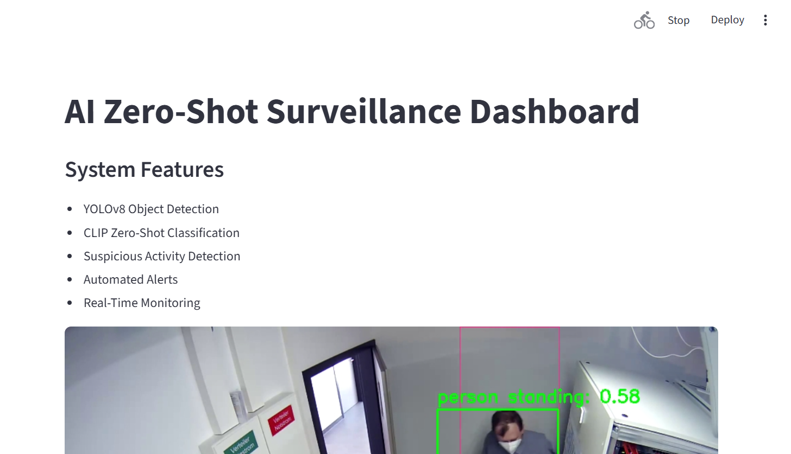
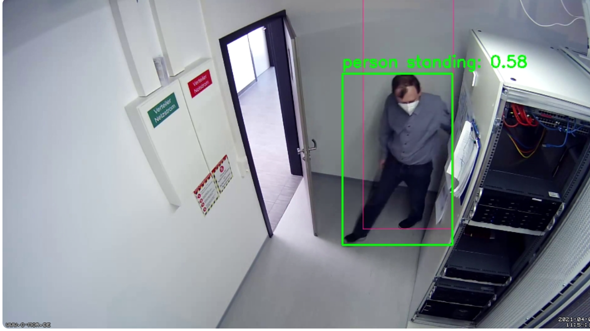
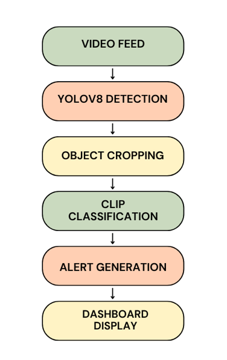

# AI Zero-Shot Surveillance System

Real-time AI surveillance system using YOLOv8 and CLIP for intelligent activity monitoring, zero-shot suspicious activity detection, and automated alert generation.

---

## Dashboard Preview

<h2>Dashboard Preview</h2>

<p align="center">
  
</p>

---

## Detection Example

<h2>Detection Example</h2>

<p align="center">
  
</p>

---

## System Architecture

<h2>System Architecture</h2>

<p align="center">
  
</p>

---

## Overview

This project combines computer vision and multimodal AI to build an intelligent surveillance monitoring system capable of detecting and classifying unseen activities using natural language prompts without task-specific retraining.

The system integrates:
- YOLOv8 for real-time object detection
- CLIP for zero-shot vision-language classification
- OpenCV for video processing
- Streamlit for interactive monitoring dashboards

---

## Key Features

- Real-time surveillance video analysis
- YOLOv8-based person detection
- CLIP zero-shot activity recognition
- Prompt-based suspicious activity classification
- Automated screenshot evidence capture
- Real-time alert monitoring dashboard
- Frame-skipping and person-only optimization pipeline
- Device-aware inference (CPU/GPU support)

---

## Example Zero-Shot Prompts

```python
[
    "person standing",
    "person walking",
    "person inspecting machine",
    "normal activity",
    "suspicious activity"
]
```

---

## Workflow Pipeline

```text
Video Feed
   ↓
YOLOv8 Object Detection
   ↓
Object Cropping
   ↓
CLIP Zero-Shot Classification
   ↓
Alert Generation
   ↓
Streamlit Dashboard
```

---

## Tech Stack

| Component | Technology |
|---|---|
| Language | Python |
| Deep Learning | PyTorch |
| Object Detection | YOLOv8 |
| Vision-Language Model | CLIP |
| Video Processing | OpenCV |
| Dashboard | Streamlit |
| NLP/Transformers | Hugging Face Transformers |

---

## Installation

### Clone Repository

```bash
git clone https://github.com/RoseJ02/zero-shot-surveillance-system.git
cd zero-shot-surveillance-system
```

### Install Dependencies

```bash
pip install -r requirements.txt
```

---

## Run the Dashboard

```bash
python -m streamlit run dashboard.py
```

---

## Project Structure

```text
zero-shot-surveillance-system/
│
├── assets/
│   ├── dashboard.png
│   ├── detection.png
│   └── architecture.png
│
├── videos/
├── outputs/
├── dashboard.py
├── pipeline.py
├── requirements.txt
└── README.md
```

---

## Future Improvements

- Live CCTV integration
- Multi-camera support
- Face recognition
- Person tracking
- Telegram/email alerts
- Cloud deployment
- Video anomaly detection

---

## Author

Rose Mary Jose